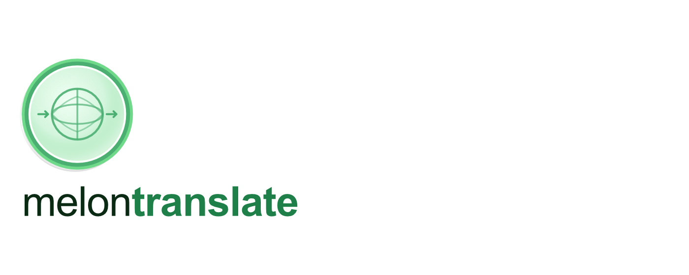
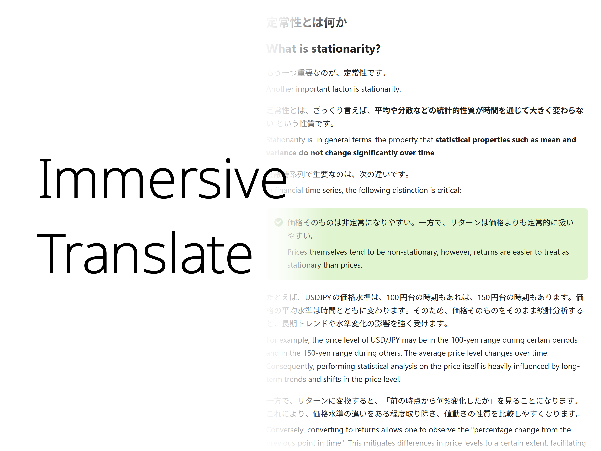
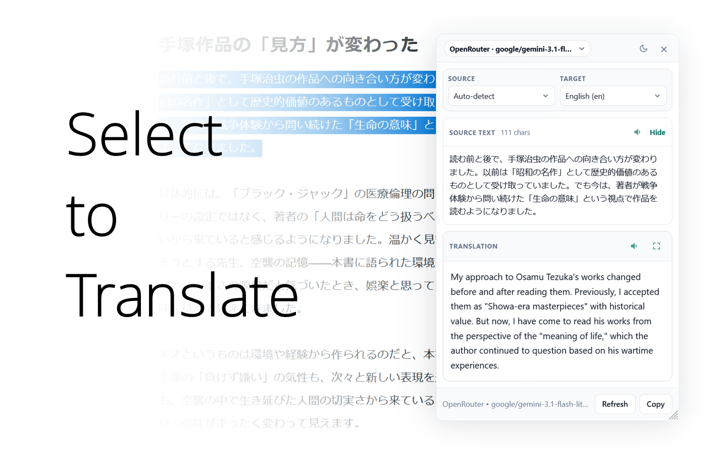
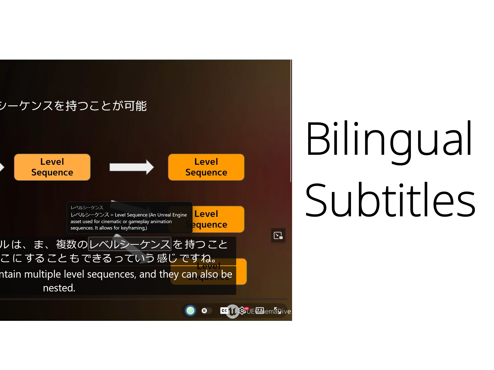
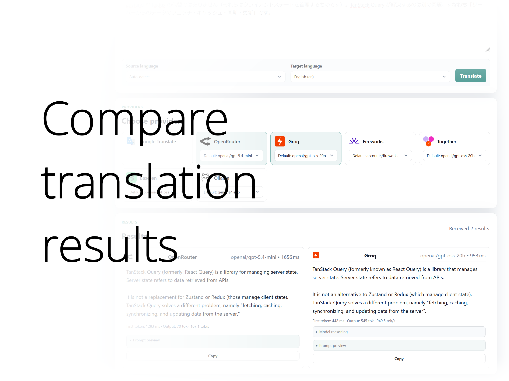

# MelonTranslate

[](https://addons.mozilla.org/en-US/firefox/addon/melontranslate/)
[](https://microsoftedge.microsoft.com/addons/detail/melontranslate/ffelhncbjmlinodcegdfoekmckdkgkpn)
[](https://chromewebstore.google.com/detail/melontranslate/cmebcigpfdaclakfhndclmjjobjjibpg)



Bring your own API key to translate web pages inline or selected text on demand.

---

## Features

- **Immersive page translation** — translate full pages inline while preserving layout.
- **Select-to-translate** — highlight text to translate, compare, copy, or read aloud.
- **Input translation button** — translate text fields in place.
- **Bilingual video subtitles** — show translated subtitles alongside the original, with learning annotations and hover word lookup. By using surrounding subtitle context and Topic Sensing, MelonTranslate can produce more accurate translations than similar tools on the same model.
- **Multiple providers** — use OpenAI, Anthropic, Gemini, DeepSeek, Groq, Google Translate, or any OpenAI-compatible provider.

---

## Screenshots

### Inline Page Translation



### Select-to-Translate



### Bilingual Video Subtitles



### Compare Mode



---

## Browser Support

| Browser | Manifest |
|---------|----------|
| Firefox 128+ | `manifest.json` |
| Chromium | `manifest.chromium.json` |

Firefox users need to grant site access for automatic page features such as select-to-translate and immersive translation on newly opened tabs. MelonTranslate prompts for this from the popup and settings page when needed.

---

## Build

```bash
./scripts/build-browser-variants.sh
```

Output:
- `dist/firefox/` — Firefox build
- `dist/chrome/` — Chromium build

---

## Testing

The test harness uses Node's built-in test runner and a local mock OpenAI-compatible server.

```bash
npm run test:unit
npm run test:e2e
npm run test:package
npm run test:live
```

- `test:unit` runs pure JS tests without a browser.
- `test:e2e` builds a demo Firefox extension, installs it as a temporary XPI through geckodriver, and verifies selection translation against the mock provider.
- `test:e2e:chrome` keeps the Chrome/CDP flow available. It auto-detects `.tools/chromium/chrome-linux/chrome` when present because current Chrome stable builds may refuse automated extension loading.
- `test:package` verifies `dist/chrome` and asks Chrome/Chromium to package it as a CRX.
- `test:live` is skipped unless `.env.test` sets `MT_LIVE_RUN=true`.

Copy `.env.test.example` to `.env.test` for optional API keys and browser overrides. Firefox E2E auto-detects `.tools/firefox/firefox` and `.tools/bin/geckodriver` when present; otherwise set `FIREFOX_EXECUTABLE_PATH` and `GECKODRIVER_PATH`. Headless Linux/WSL also needs `xvfb-run`.

---

## Privacy

See [PRIVACY_POLICY.md](PRIVACY_POLICY.md).

---

## License

[MIT License](LICENSE).
